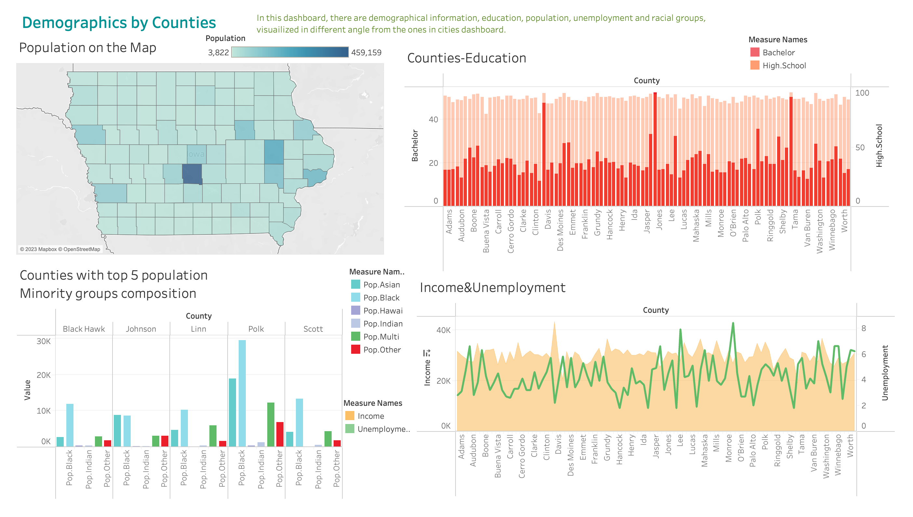
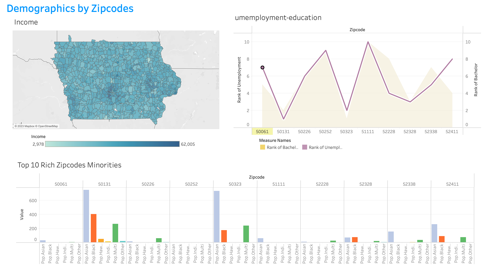
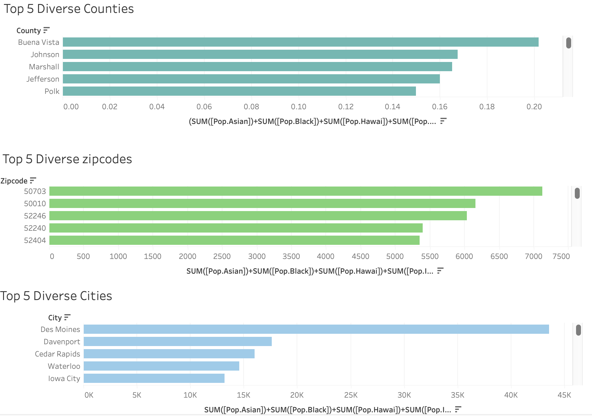
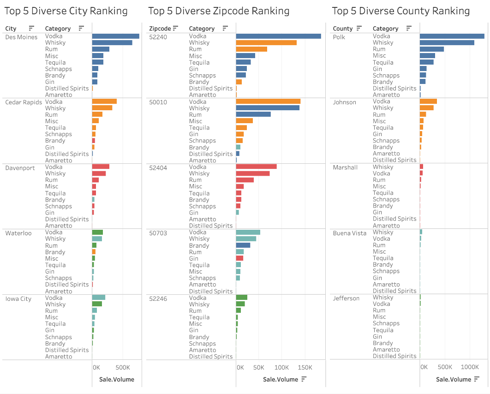

------------------------------------------------------------------------

------------------------------------------------------------------------

--- title: "Course Project" author: "Team 5" date: "2023-02-10" output: html_document ---

## **Introduction**

The project is a market research based on the demographic and sales data in Iowa, for a liquor company who has a PR crisis for racism speech of an employee, thriving for an emergency campaign strategy to save their reputation, targeting at minorities audience. The research questions are:

1.  Are there any preference patterns for liquor consumption among different races?

2.  What are most popular liquor categories among geographies with highest share of minorities?

The market information in the analysis would be used to establish and design the specific marketing strategies of this PR campaign. Data analytics in this project will be crucial to the company's reputation, stock price and their reputation.

## Data Summary

There are two data sets used in this project: **liquor sales data** and the **American Community Survey data** based on different geography variables - zipcode, city and county.

The **American Community Survey data** is the "premier source for detailed population and housing information about our nation(USCB)", providing sufficient information for businesses, policy makers and government officials within a community. The variables in ACS data include the racial identity information of the population of Asian, White, Black, Hawai, Indian, Multiracial, others and the total population; the educational information, which are the population percentage of high school graduates and bachelor degree holders; The rate of unemployment is also provided for further analysis purposes.

The **sales data** records the spirits purchase information of Iowa Class "E" liquor licensees by product and date of purchase from January 1, 2012 to current. Class E liquor license, for grocery stores, liquor stores, convenience stores, etc., allows commercial establishments to sell liquor for off-premises consumption in original unopened containers. The dataset includes data on the types of liquor, the quantities sold, the prices, the stores where the sales were made, and the dates of the sales; it can be used to analyze total spirits sales in Iowa of individual products at the store level.

The dates of sales, for example, can be helpful for identifying trends in liquor sales over time. What's more, it also reveals certain seasonal variations or other fluctuations that could rich our analysis. Data on different types of liquor and stores, on the other hand, is useful for identifying patterns in sales based on location or product type.

## Data Analytics

### Jin - Sales Data

Here I emphasized on exploring the ranking of different categories of liquor sold in each demographics. It's interesting to see the how sales pattern follow a similar pattern across different demographics.

Here is the aggregated sales data from different cities within Iowa state. We see from the pie chart how Whisky and Vodka take up more than half the entire sales, with 61% of sales in total!

The city ranking chart further proves that. We see clearly how the first two categories representing Whisky and Vodka sales have much longer bars than the rest categories.

The city dynamic ranking on the left is a bit messy to look at, but one interesting finding is how city named Des Moines take down most sales in almost every category of liquor except Distilled Spirits(sold most in Mount Vernon instead). Cedar Rapids and Davenport gets a close chase after Des Moines in terms of aggregated sales.

Next we could conduct a similar research using the county data instead. Below is a reprint of the results we have.

Narrowing down the demographics scale to county doesn't change the fact that Whisky and Vodka are still two most popular categories. Again, pie chart and county ranking reflect many empirical evidence of liquor sales.

The county ranking dynamics seem comparatively neater than the city one, indicating how there is less disparity in terms of liquor categories sold in each county, which makes sense because narrower region usually reduce the possibility of liquor variations.

Let's now take a look at the zip code data.

Skipping the zip code ranking and pie chart which conform with the previous analysis on city and county, let's head straight into analyzing the ranking dynamics. Surprisingly the ranking dynamics didn't show an even neater pattern as we'd expected for a even narrower region. One possible explanation for this may be due to the fact that data relating to zip code is too detailed and detached, thus hard to follow a pattern out of it. Think of a county consisting of 15 zip codes, zip codes that are in older neighborhood or near campus would yield very different sales data among liquor categories, thus there hardly is any pattern in terms of zip code preference.

### Liuyi - ACS data

For the ACS data, there are several aspects that need investigation: education, employment, income and race.

The first dashboard is based on the '**city**' geographical variable. On the top right corner, there is a map reflecting both highschool and college education distribution across whole Iowa state. To take a further look, we filtered the cities with top 10 unemployment rate, and display the education situations in these towns: the population with college degree is above and below 20%, but high school graduation rate is close to 90% for almost all cities. Compared with the top 10 cities with highest income, we could find out *the economic polarization in Iowa is severe:* there is no overlapping in the developed cities and cities with high unemployment rates.

The lower row are 5 graphs showing the cities distribution with highest racial group. *Des Moines seems to has higher proportion of Asian and Black groups, while Hawaiians settle most at Dubuque and Indians prefer Sioux City.* White people, as the dominated racial group, distributed evenly in most cities.

Based on the geographical variable "**county**", we looked at the total population distribution on the state map; the high school and college graduation rate among all the counties: with *Johnson, Story and Dallas as top 3 educated counties among Iowa*.

Next, we analyzed the minority groups composition in the counties with highest population: *Polk is relatively more diverse than other counties, with more Asian, Black and Multiracial population*. This dashboard also includes a graph comparing the income and unemployment rate.

Based on the "zipcode" variable, we focuses on the income distribution across the whole state with smaller administration district units - we can clearly see *there are three main economic centers, which are the Greater Polk area, Pottawattamie and Linn-Johnson area.* Within the top income zipcodes, we have analyzed the education and unemployment ranking as shown in the graph on the right.

On the bottom, we have the minorities distribution within these rich zipcodes. *In 50323 and 50131, there are more Black, Asian and Multiracial groups population, although white people are still the absolute dominant groups even in these two areas*.

### Nick - Merged data

## Conclusion

ACS data:

*In conclusion,* the economic status and race balance is very polarized in Iowa state, with white people as the absolute dominant racial groups in most of the areas.

There are three main *economic* centers, which are the Greater Polk area, Pottawattamie and Linn-Johnson area. Johnson, Story and Dallas as top 3 educated counties among Iowa.

Des Moines has higher proportion of Asian and Black groups, while Hawaiians settle most at Dubuque and Indians prefer Sioux City. In 50323 and 50131, there are more Black, Asian and Multiracial groups population. Polk is relatively more diverse than other counties, with more Asian, Black and Multiracial population.

### Research Question 1

Are there any preference patterns for liquor consumption among different races?

### Research Question 2

What are most popular liquor categories among geographies with highest share of minorities?

The graph above shows the sales ranking data for three demographics, each with 5 highest shares of minorities within the region.

From the graph we can see that despite the shares of minorities within each region, the most popular liquor categories are always Vodka, Whisky, and Rum, in a descending order. There is, however, only one exception within zip code 50703 where the most popular liquor categories are Vodka, Whisky, and Brandy (instead of Rum).

## Policy Recommendation

1.  As white people as the dominant racial groups in most Iowa areas, the effect of this PR crisis in Iowa is moderate comparing to other states which are more diverse.
2.  To stay in budget of the on-site events later, we suggest the liquor company to focus more in:
    1.  the greater Polk County area, Pottawattamie and Linn-Johnson area as they are the areas with highest purchasing power;

    2.  Johnson, Story and Dallas counties, as they are the top 3 educated counties among Iowa, which could be more liberal than other counties;

    3.  Des Moines, Dubuque and Sioux cities as they have the highest minority population proportions;
3.  When looking at these areas, pay more attention to the Vodka, Whiskey and Rum series products, as these are the favorite liquor categories.
